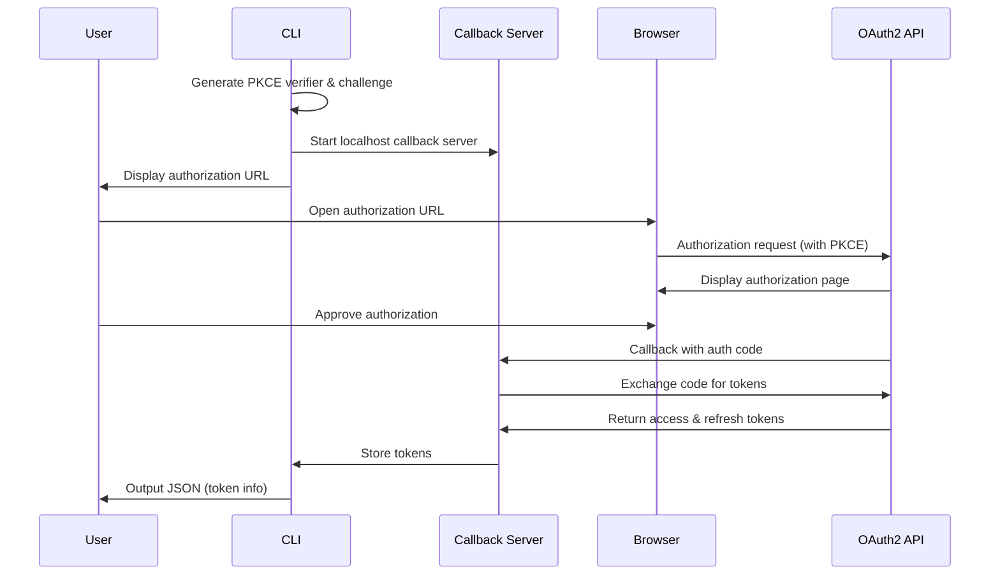

# Xion Agent Toolkit - Development Guidelines

## Project Overview

Xion Agent Toolkit is a CLI-driven, Agent-oriented toolkit designed to facilitate development on the Xion blockchain. Built on Xion's MetaAccount system, it leverages OAuth2 API to provide a gasless development experience.

## Core Principles

### 1. Agent-First Design
- All features prioritize Agent invocation scenarios
- CLI output formatted as JSON for easy Agent parsing
- Structured error messages with error codes and remediation suggestions

### 2. MetaAccount-Centric
- Based on OAuth2 authentication flow, not traditional mnemonic
- Uses Session Key for transaction signing
- Supports Fee Grant and Authz Grant

### 3. Modular Architecture
- CLI tool as the core component
- Skills as Agent extensions
- Independent and transparent configuration management

## Technology Stack

### Main Tool: Rust
- **CLI Framework**: clap (v4.x) - Powerful command-line argument parsing
- **HTTP Client**: reqwest + tokio - Asynchronous HTTP requests
- **Serialization**: serde + serde_json - JSON processing
- **Configuration Management**: directories - Cross-platform configuration directories
- **Error Handling**: thiserror + anyhow - Structured errors
- **Logging**: tracing + tracing-subscriber - Structured logging
- **Credential Storage**: keyring - OS-native credential storage

### Skills: Bash + Node.js
- Follows [Agent Skills](https://agentskills.io/) format
- Outputs JSON to stdout, status messages to stderr
- Scripts use `set -e` for fail-fast behavior

## Project Structure

```
xion-agent-cli/
├── AGENTS.md                    # This file - Development Guidelines
├── Cargo.toml                   # Rust project configuration
├── src/
│   ├── main.rs                  # CLI entry point
│   ├── cli/                     # CLI command definitions
│   │   ├── mod.rs
│   │   ├── auth.rs              # OAuth2 authentication commands
│   │   ├── treasury.rs          # Treasury management commands
│   │   └── config.rs            # Configuration management commands
│   ├── oauth/                   # OAuth2 client implementation
│   │   ├── mod.rs
│   │   ├── client.rs            # OAuth2 client
│   │   ├── token.rs             # Token management
│   │   └── pkce.rs              # PKCE implementation
│   ├── api/                     # API clients
│   │   ├── mod.rs
│   │   ├── oauth2_api.rs        # OAuth2 API Service client
│   │   ├── treasury.rs          # Treasury API
│   │   └── xiond.rs             # xiond query client
│   ├── config/                  # Configuration management
│   │   ├── mod.rs
│   │   ├── manager.rs           # Configuration manager
│   │   └── schema.rs            # Configuration Schema
│   └── utils/                   # Utility functions
│       ├── mod.rs
│       ├── output.rs            # Output formatting
│       └── error.rs             # Error definitions
├── skills/                      # Agent Skills
│   ├── xion-oauth2/             # OAuth2 setup
│   │   ├── SKILL.md
│   │   └── scripts/
│   ├── xion-treasury/           # Treasury management
│   │   ├── SKILL.md
│   │   └── scripts/
│   └── xion-deploy/             # Smart contract deployment (future)
│       ├── SKILL.md
│       └── scripts/
└── plans/                       # Development plan documents
    └── treasury-automation.md
```

## Development Phases

### Phase 1: Foundation (Days 1-7)
1. CLI framework setup
2. Configuration management system
3. OAuth2 client basic functionality

### Phase 2: Core Features (Days 8-21)
1. OAuth2 authentication flow (PKCE)
2. Token management and auto-refresh
3. Treasury query and creation
4. Grant configuration (Fee + Authz)

### Phase 3: Skills Development (Days 22-28)
1. xion-oauth2 skill
2. xion-treasury skill
3. Documentation and examples

## Code Standards

### Rust Code Standards

```rust
// 1. Use thiserror for error definitions
#[derive(Debug, thiserror::Error)]
pub enum OAuthError {
    #[error("Failed to exchange code: {0}")]
    CodeExchange(String),
    
    #[error("Token expired")]
    TokenExpired,
}

// 2. Use serde for serialization
#[derive(Debug, Serialize, Deserialize)]
pub struct TreasuryInfo {
    pub address: String,
    pub admin: String,
    pub balance: String,
}

// 3. CLI output must be JSON
pub fn output_json<T: Serialize>(data: &T) -> Result<()> {
    let json = serde_json::to_string_pretty(data)?;
    println!("{}", json);
    Ok(())
}

// 4. Errors to stderr
pub fn output_error(error: &Error) {
    eprintln!("{}", error);
    process::exit(1);
}
```

### CLI Command Design Principles

```bash
# 1. All commands support JSON output
xion auth login --output json
xion treasury list --output json

# 2. Errors include error codes
xion treasury create --fee 1000
# Error: INSUFFICIENT_BALANCE
# Message: Treasury requires at least 1000000 uxion
# Suggestion: Fund your account with 'xion treasury fund'

# 3. Support config file and command-line arguments
xion --network testnet treasury list
xion --config ~/.xion-toolkit/config.json treasury list
```

### Skills Script Standards

```bash
#!/bin/bash
set -e  # Fail fast

# 1. Output JSON to stdout
output_json() {
    echo "$1"
}

# 2. Status messages to stderr
log_info() {
    echo "[INFO] $1" >&2
}

# 3. Error handling
handle_error() {
    output_json "{\"success\": false, \"error\": \"$1\", \"code\": \"$2\"}"
    exit 1
}

# Main logic
main() {
    log_info "Starting treasury creation..."
    
    # Call CLI tool
    result=$(xion treasury create --output json 2>&1)
    
    if [ $? -eq 0 ]; then
        output_json "$result"
    else
        handle_error "$result" "TREASURY_CREATE_FAILED"
    fi
}

main
```

## Configuration Management

### Configuration File Location
```
~/.xion-toolkit/
├── config.json              # Main configuration
├── credentials.json         # Encrypted credentials (via keyring)
└── cache/
    └── token.json           # Token cache
```

### Configuration Schema

```json
{
  "version": "1.0",
  "network": "testnet",
  "oauth": {
    "client_id": "your-client-id",
    "access_token": "encrypted-token",
    "refresh_token": "encrypted-refresh-token",
    "expires_at": "2024-01-01T00:00:00Z"
  },
  "treasury": {
    "default_address": "xion1..."
  },
  "networks": {
    "local": {
      "oauth_api_url": "http://localhost:8787",
      "rpc_url": "http://localhost:26657",
      "chain_id": "xion-local",
      "treasury_code_id": null
    },
    "testnet": {
      "oauth_api_url": "https://oauth2.testnet.burnt.com",
      "rpc_url": "https://rpc.xion-testnet-2.burnt.com:443",
      "chain_id": "xion-testnet-2",
      "treasury_code_id": 1260,
      "treasury_config": "xion175qd54keur7gkuwtctfupgtucvlvkrxhv0pgq753sfh5xueputvsms6nll"
    },
    "mainnet": {
      "oauth_api_url": "https://oauth2.burnt.com",
      "rpc_url": "https://rpc.xion-mainnet-1.burnt.com:443",
      "chain_id": "xion-mainnet-1",
      "treasury_code_id": 63,
      "treasury_config": "xion1dlsvvgey26ernlj0sq2afjluh3qd4ap0k9eerekfkw5algqrwqkshmn3uq"
    }
  }
}
```

## Network Configuration

The toolkit supports three network environments:

### Local Development
- **OAuth API**: http://localhost:8787
- **RPC**: http://localhost:26657
- **Chain ID**: xion-local
- **Usage**: For local development and testing

### Testnet
- **OAuth API**: https://oauth2.testnet.burnt.com
- **RPC**: https://rpc.xion-testnet-2.burnt.com:443
- **Chain ID**: xion-testnet-2
- **Treasury Code ID**: 1260
- **Treasury Config**: xion175qd54keur7gkuwtctfupgtucvlvkrxhv0pgq753sfh5xueputvsms6nll

### Mainnet
- **OAuth API**: Coming soon
- **RPC**: https://rpc.xion-mainnet-1.burnt.com:443
- **Chain ID**: xion-mainnet-1
- **Treasury Code ID**: 63
- **Treasury Config**: xion1dlsvvgey26ernlj0sq2afjluh3qd4ap0k9eerekfkw5algqrwqkshmn3uq

## OAuth2 Authentication Flow

### Pre-configured OAuth Clients

The toolkit uses pre-configured OAuth clients for each network. These clients are already set up with the necessary permissions to manage Treasury contracts, providing the same capabilities as the Developer Portal.

### Login Flow



### Callback Server

The CLI implements a localhost callback server to handle OAuth2 redirects:
- **Default Port**: 8080 (configurable)
- **Callback Path**: /callback
- **Timeout**: 5 minutes
- **Security**: Only accepts localhost connections

## Git Standards

### Commit Messages
```
feat(cli): add OAuth2 login command
fix(treasury): handle insufficient balance error
docs(skill): update xion-treasury skill documentation
chore(config): migrate to new config schema
```

### Branch Strategy
- `main` - Stable release
- `develop` - Development version
- `feature/*` - Feature branches
- `fix/*` - Bug fix branches

## Testing Standards

### Unit Tests
```rust
#[cfg(test)]
mod tests {
    use super::*;
    
    #[test]
    fn test_pkce_challenge() {
        let verifier = generate_pkce_verifier();
        let challenge = generate_pkce_challenge(&verifier);
        assert!(verify_pkce(&verifier, &challenge));
    }
}
```

### Integration Tests
```rust
#[tokio::test]
async fn test_oauth_login() {
    let client = OAuthClient::new("http://localhost:8787");
    let result = client.login().await;
    assert!(result.is_ok());
}
```

## Security Standards

1. **Token Storage**
   - Use OS-native keyring for encrypted storage
   - Never store tokens in plain text
   - Separate storage for different networks

2. **PKCE Implementation**
   - Use cryptographically secure random number generator
   - Verifier length at least 43 characters
   - Use SHA-256 for challenge generation

3. **API Communication**
   - Enforce HTTPS for all external communications
   - Validate server certificates
   - Implement request timeout

4. **Callback Server**
   - Only bind to localhost
   - Validate state parameter
   - Implement timeout mechanism
   - Use random port if default is occupied

## Documentation Standards

1. **README.md** - Project overview and quick start
2. **docs/** - Detailed documentation
   - `cli-reference.md` - CLI command reference
   - `oauth-flow.md` - OAuth2 flow explanation
   - `treasury-guide.md` - Treasury usage guide
3. **examples/** - Example code and scripts

## Related Resources

- [Xion Documentation](https://docs.burnt.com/xion)
- [OAuth2 API Service](https://github.com/burnt-labs/xion/tree/main/oauth2-api-service)
- [Developer Portal](https://dev.testnet2.burnt.com)
- [Agent Skills Format](https://agentskills.io/)
- [Xion Skills](https://github.com/burnt-labs/xion-skills)

## Contact

- Telegram Developer Group: [Link]
- Discord Dev Chat: [Link]
- GitHub Issues: [Project Issues Page]
