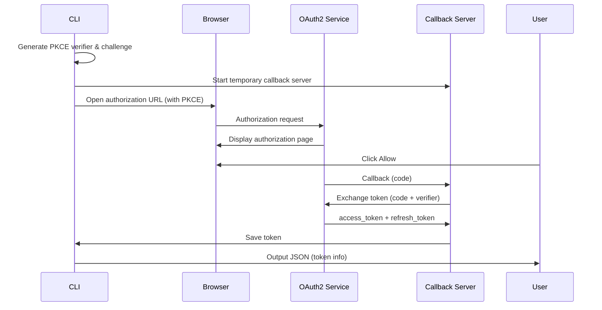

# Treasury Automation Plan

## Background

Xion's Treasury contracts provide gasless transactions and delegated authorization capabilities. Currently, these must be manually created and configured through the Developer Portal. To enable an Agent-driven development workflow, we need to build a CLI tool that can automate Treasury creation, configuration, and management.

## Goals

1. **Automate Treasury Creation**: Automatically create Treasury contracts via OAuth2 API
2. **Automate Grant Configuration**: Automatically configure Fee Grants and Authz Grants
3. **Fund Management**: Support balance queries, deposits, and withdrawals
4. **Agent-Friendly**: CLI outputs JSON for easy Agent parsing and processing

## Implementation Plan

### Phase 1: Foundation

#### 1.1 Technology Stack
- **Language**: Rust
- **Reasons**:
  - High performance, suitable for CLI tools
  - Strong type system, reduces runtime errors
  - Excellent cross-platform support
  - Mature ecosystem (clap, serde, tokio, reqwest, keyring)

#### 1.2 Core Modules

```
xion-agent-cli/
├── CLI Core
│   ├── auth - OAuth2 authentication commands
│   ├── treasury - Treasury management commands
│   └── config - Configuration management commands
├── OAuth2 Client
│   ├── PKCE implementation
│   ├── Token management
│   └── Auto-refresh
├── API Clients
│   ├── OAuth2 API Service
│   ├── xiond Query
│   └── Treasury API
└── Configuration Management
    ├── JSON configuration
    ├── Credential encryption (keyring)
    └── Cache management
```

### Phase 2: Core Features

#### 2.1 OAuth2 Authentication Flow



**Key Features**:
- Localhost callback server on port 8080 (configurable)
- PKCE for enhanced security
- Automatic token refresh
- Secure token storage via OS keyring

#### 2.2 Treasury Creation Flow

**Approach: Via OAuth2 API (Recommended)**

The toolkit uses pre-configured OAuth clients that are already set up with Treasury management capabilities. This provides the same functionality as the Developer Portal.

```bash
# 1. Check authentication status
xion auth status

# 2. Login if needed
xion auth login

# 3. List existing treasuries
xion treasury list

# 4. Create a new treasury
xion treasury create \
  --fee-grant basic:1000000uxion \
  --grant-config authz:cosmwasm.wasm.v1.MsgExecuteContract

# 5. Query treasury details
xion treasury query <treasury-address>
```

**Network Support**:
- **local**: http://localhost:8787 (local OAuth2 service)
- **testnet**: https://oauth2.testnet.burnt.com/
- **mainnet**: Coming soon

#### 2.3 Grant Configuration

**Fee Grant Configuration Example**:
```json
{
  "allowance_type": "BasicAllowance",
  "spend_limit": [
    {
      "denom": "uxion",
      "amount": "1000000"
    }
  ]
}
```

**Authz Grant Configuration Example**:
```json
{
  "type_url": "/cosmwasm.wasm.v1.MsgExecuteContract",
  "authorization": {
    "type": "ContractExecutionAuthorization",
    "contract": "xion1...",
    "limits": {
      "max_calls": 100,
      "max_funds": [
        {
          "denom": "uxion",
          "amount": "10000000"
        }
      ]
    }
  }
}
```

### Phase 3: Skills Development

#### 3.1 xion-oauth2 Skill

**Purpose**: Guide users through OAuth2 authentication setup

**Scripts**:
- `login.sh` - Initiate OAuth2 login flow
- `status.sh` - Check authentication status
- `logout.sh` - Clear stored credentials
- `refresh.sh` - Manually refresh access token

#### 3.2 xion-treasury Skill

**Purpose**: Manage Treasury contracts

**Scripts**:
- `create.sh` - Create a new Treasury
- `list.sh` - List user's Treasury contracts
- `query.sh` - Query Treasury details
- `fund.sh` - Fund a Treasury
- `withdraw.sh` - Withdraw from Treasury
- `grant-config.sh` - Configure Authz Grants
- `fee-config.sh` - Configure Fee Grants
- `update-params.sh` - Update Treasury parameters

### Phase 4: Testing & Documentation

#### 4.1 Testing Scenarios

1. **OAuth2 Authentication Tests**
   - New user first login
   - Token refresh
   - Token expiration handling
   - Network switching

2. **Treasury Management Tests**
   - Create Treasury
   - Query Treasury
   - Update configuration
   - Deposit/withdrawal

3. **Grant Configuration Tests**
   - Configure Fee Grant
   - Configure Authz Grant
   - Verify Grant effectiveness

4. **Network Tests**
   - Switch between local/testnet/mainnet
   - Verify correct API endpoints
   - Cross-network token isolation

#### 4.2 Testing Environment
- Xion Testnet (xion-testnet-2)
- Local OAuth2 API Service (Docker or local build)
- Mock callback server for automated testing

## Task Checklist

### Phase 1: Foundation (Days 1-7)
- [x] Project initialization (Cargo project)
- [x] CLI framework setup (clap)
- [x] Configuration management system
  - [x] Configuration file read/write
  - [x] Credential encryption (using keyring) - **Completed**
  - [x] Cache management
- [x] Error handling framework
- [x] Output formatting (JSON)
- [x] Network configuration
  - [x] local/testnet/mainnet endpoints
  - [x] Network switching commands
- [x] Configuration architecture refactor
  - [x] Separate network config (compile-time) from user data
  - [x] OAuth Client IDs from environment variables
  - [x] Per-network credential storage
  - [x] Callback port: 54321 (changed from 8080)

### Phase 2: OAuth2 Client (Days 8-14)
- [ ] PKCE implementation
  - [ ] Generate verifier
  - [ ] Generate challenge
  - [ ] Validation logic
- [ ] OAuth2 client
  - [ ] Authorization URL generation
  - [ ] Localhost callback server
  - [ ] Code exchange
  - [ ] Token refresh
- [ ] Token management
  - [ ] Secure storage (keyring)
  - [ ] Auto-refresh
  - [ ] Expiration checking
- [ ] Authentication commands
  - [ ] login - OAuth2 login
  - [ ] status - Check auth status
  - [ ] logout - Clear credentials

### Phase 3: Treasury API (Days 15-21)
- [ ] API clients
  - [ ] OAuth2 API Service client
  - [ ] xiond Query client
  - [ ] Error handling
- [ ] Treasury commands
  - [ ] list - List Treasury contracts
  - [ ] query - Query details
  - [ ] create - Create Treasury
  - [ ] fund - Fund Treasury
  - [ ] withdraw - Withdraw from Treasury
- [ ] Grant configuration
  - [ ] fee-grant configuration
  - [ ] authz-grant configuration
  - [ ] Verify configuration effectiveness

### Phase 4: Skills & Documentation (Days 22-28)
- [ ] xion-oauth2 Skill
  - [ ] login.sh
  - [ ] status.sh
  - [ ] logout.sh
  - [ ] refresh.sh
  - [ ] SKILL.md
- [ ] xion-treasury Skill
  - [ ] create.sh
  - [ ] list.sh
  - [ ] query.sh
  - [ ] fund.sh
  - [ ] withdraw.sh
  - [ ] grant-config.sh
  - [ ] fee-config.sh
  - [ ] update-params.sh
  - [ ] SKILL.md
- [ ] Documentation
  - [ ] README.md
  - [ ] CLI Reference
  - [ ] OAuth2 Flow documentation
  - [ ] Treasury Guide
  - [ ] Network Configuration Guide
- [ ] Testing
  - [ ] Unit tests
  - [ ] Integration tests
  - [ ] E2E tests

## Acceptance Criteria

### Functional Acceptance
- [ ] Users can complete OAuth2 authentication via CLI
- [ ] Users can create and manage Treasury contracts
- [ ] Users can configure Fee Grants and Authz Grants
- [ ] All commands support JSON output
- [ ] Error messages are structured with remediation suggestions
- [ ] Network switching works correctly (local/testnet/mainnet)
- [ ] Status command shows current network and authentication state

### Performance Acceptance
- [ ] OAuth2 login flow < 10 seconds
- [ ] Treasury query < 2 seconds
- [ ] CLI startup time < 100ms

### Security Acceptance
- [ ] Tokens encrypted and stored in OS keyring
- [ ] PKCE prevents code interception attacks
- [ ] Enforce HTTPS communication
- [ ] Sensitive information not logged
- [ ] Callback server only accepts localhost connections

### Cross-Platform Acceptance
- [ ] Works on macOS
- [ ] Works on Linux
- [ ] Works on Windows
- [ ] Keyring integration works on all platforms

## Sign-off

| Date | Completed Tasks | Status |
|------|-----------------|--------|
| 2025-03-05 | Created development plan | ✅ |
| 2025-03-05 | Created AGENTS.md guidelines | ✅ |
| 2025-03-05 | Phase 1: Project initialization (Cargo) | ✅ |
| 2025-03-05 | Phase 1: CLI framework (clap) | ✅ |
| 2025-03-05 | Phase 1: Configuration management (JSON) | ✅ |
| 2025-03-05 | Phase 1: Error handling (thiserror) | ✅ |
| 2025-03-05 | Phase 1: Output formatting (JSON) | ✅ |
| 2025-03-05 | Phase 1: Network configuration (local/testnet/mainnet) | ✅ |
| 2025-03-05 | Created comprehensive README.md | ✅ |
| 2025-03-05 | Phase 1: Config architecture refactor | ✅ |
| 2025-03-05 | Phase 1: Credential encryption (keyring) | ✅ |
| 2025-03-05 | Phase 1: Per-network credentials | ✅ |
| 2025-03-05 | Phase 1: OAuth Client IDs from env vars | ✅ |

---
*Created: 2025-03-05*
*Last Updated: 2025-03-05*
